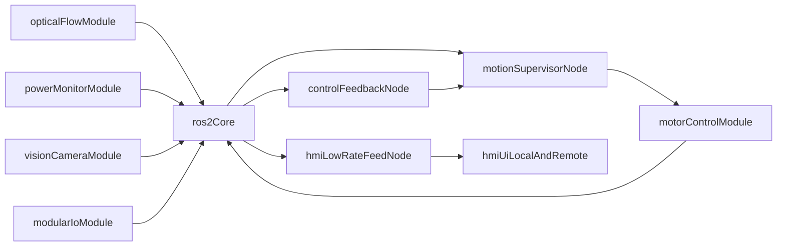

# Ball Rotation Platform Architecture

## 1. Purpose

This document defines the target system architecture and the staged execution path for the ball-rotation platform.

Primary goals:

- modular development by subsystem
- safe operation under power, comms, and sensing faults
- ROS2-native integration and observability
- local touchscreen HMI with remote browser mirror
- support for high-rate control while preserving a practical development workflow

## 2. Platform Context

- Main host: Raspberry Pi 4 (ROS2 runtime and integration point)
- Optical flow sensor module over SPI (primary) with LED brightness calibration path
- Power monitor module over I2C (Waveshare INA219 4-channel board)
- Global shutter camera + AI HAT+ for vision processing
- Maker Pi modular I/O board over USB serial (auxiliary sensors and controls)
- RoboClaw motor drivers with encoder feedback and external safety wiring

## 3. Staged Execution Roadmap

Development order is fixed for the current phase:

1. Optical-flow polish and calibration-readiness
2. Power monitor module
3. Camera and AI module
4. Modular I/O module
5. Motor control module (C++-first)
6. ROS2 + HMI full integration

This order prioritizes sensor reliability and safety observability before full closed-loop integration.

## 4. Module Responsibilities

### 4.1 Optical Flow Module (`optical_flow`)

- provide robust smoke diagnostics and repeatable logging
- produce calibrated motion-related outputs from sensor counts
- support LED control experiments, including LUT-based brightness linearization
- expose ROS2-ready profile outputs for runtime node configuration

### 4.2 Power Monitor Module (`power_monitor`)

- read voltage/current/power from INA219 channels
- apply shunt-dependent conversion and calibration scaling
- monitor safety thresholds for undervoltage/overcurrent persistence
- publish safety state recommendations and structured telemetry

### 4.3 Camera and AI Module (`vision_camera`)

- capture camera stream locally and for remote preview
- run vision experiments for ball tracking and seam/rotation cues
- split outputs into control-grade features and low-rate HMI feed
- integrate optional Neopixel illumination tuning paths

### 4.4 Modular I/O Module (`modular_io`)

- connect Maker Pi as non-critical auxiliary coprocessor over USB
- bridge Grove-like sensors, buttons, encoder, and OLED status
- permit rapid MicroPython/CircuitPython iteration
- provide ROS2 bridgeable data and setpoint inputs without becoming a control dependency

### 4.5 Motor Control Module (`motor_control`)

- implement C++ driver path for highest-bandwidth control feedback
- support robust communication modes and documented fallback options
- stream encoder/state/fault telemetry and accept runtime parameter updates
- enforce driver-level safety and participate in global fault arbitration

### 4.6 Integration Module (`ros2_hmi`)

- define and host the full ROS2 graph contracts
- provide local touchscreen operator interface and remote browser mirror
- aggregate diagnostics, logs, and trend views across all modules
- support profile/preset-based operation modes

## 5. Cross-Module Interface Contracts

Each module must define and maintain these interfaces:

- **Data contract:** output fields, units, valid ranges, and timestamps
- **Rate contract:** nominal publish rate, min viable rate, max tested rate
- **Safety contract:** fault states and recommended supervisor action
- **Config contract:** parameter keys, defaults, and allowed overrides
- **Log contract:** standard CSV/JSON outputs and summary schema

Core integrations:

- Optical flow -> motion supervisor and diagnostics
- Power monitor -> safety supervisor and diagnostics
- Camera/AI -> control feedback node and HMI preview node
- Modular I/O -> HMI/backend and optional setpoint interfaces
- Motor control <-> motion supervisor for commands, state, and faults

## 6. Safety and Fault Escalation Policy

Safety handling is hierarchical and conservative:

1. Detect fault condition in module local checks.
2. Publish module fault state with severity and confidence.
3. Supervisor applies policy action.
4. HMI and logs capture event timeline.

Priority faults and default actions:

- `estop_active`: immediate command disable; manual software recovery path required after hardware release
- `motor_comms_lost`: disable motion outputs and enter fault hold
- `overcurrent_persistent`: reduce/stop motion according to configured limits and dwell time
- `undervoltage_persistent`: disable or derate motion to avoid brownout instability
- `overvoltage_event`: disable motion and log regenerative event details
- `sensor_dropout_critical`: degrade to safe mode or hold depending on active control mode

Degraded operation principle:

- non-critical module failure should not crash core runtime
- core motion command path failures force immediate safe state

## 7. Runtime and Dataflow Target

## 8. ROS2 and HMI Target Layout

Planned ROS2 node groups:

- `motor_control`: high-rate driver and telemetry
- `motion_supervisor`: arbitration, limits, and safety state machine
- `sensor_power`: INA219 polling, scaling, threshold checks
- `sensor_optical_flow`: flow acquisition and calibrated outputs
- `vision_pipeline`: feature extraction and tracking outputs
- `makerpi_bridge`: USB serial bridge for auxiliary I/O
- `hmi_backend`: API/WebSocket bridge for local and remote UI
- `diagnostics`: heartbeat, fault rollup, event stream, and recorder control

HMI model:

- local fullscreen touchscreen UI on Pi
- remote mirrored browser access over LAN/Wi-Fi
- low-rate preview streams for bandwidth-sensitive paths
- profile/preset management for rapid mode switching

## 9. Verification and Deliverable Gates

Each module must reach these gates before integration:

- smoke test script and command documented
- calibration protocol drafted (or executed when hardware ready)
- bandwidth/poll-rate baseline measured
- structured logs and graphs available
- experimental script clearly separated from production path
- ROS2 node interface draft prepared

System integration gate:

- all module interfaces linked in `docs/project-todo.md`
- active fault matrix validated across representative failure cases
- HMI displays safety state, key telemetry, and error context

## 10. Documentation Spine

Primary planning and execution docs:

- Architecture: `docs/ball-rotation-architecture.md`
- Project backlog and troubleshooting: `docs/project-todo.md`
- Module docs: `docs/modules/*.md`
- Optical flow implementation details: `optical_flow/README.md`

All module docs must link back to this architecture and to shared conventions in `docs/conventions.md`.

## 11. Hardware and Vendor Reference Index

Use these links as the canonical reference set for datasheets, wiring guides, and official setup instructions.

- Waveshare Current/Power Monitor HAT (INA219, 4-channel):
  - [https://www.waveshare.com/wiki/Current/Power_Monitor_HAT](https://www.waveshare.com/wiki/Current/Power_Monitor_HAT)
- Raspberry Pi AI HAT+ documentation:
  - [https://www.raspberrypi.com/documentation/accessories/ai-hat-plus.html](https://www.raspberrypi.com/documentation/accessories/ai-hat-plus.html)
- RoboClaw 2x15A motor controller:
  - [https://www.basicmicro.com/RoboClaw-2x15A-Motor-Controller_p_10.html](https://www.basicmicro.com/RoboClaw-2x15A-Motor-Controller_p_10.html)
- Maxon RE25 motor (`339152`) catalog page:
  - [https://www.maxongroup.nl/medias/sys_master/root/9398012936222/Cataloge-Page-EN-157.pdf](https://www.maxongroup.nl/medias/sys_master/root/9398012936222/Cataloge-Page-EN-157.pdf)
- Maxon GP 26 B gearhead (`144027`) catalog page:
  - [https://www.maxongroup.com/medias/sys_master/root/8807110869022/13-382-EN.pdf](https://www.maxongroup.com/medias/sys_master/root/8807110869022/13-382-EN.pdf)
- Maxon encoder MR ML 500 CPT (`225778`) catalog page:
  - [https://www.maxongroup.co.uk/medias/sys_master/root/8883965493278/EN-21-478.pdf](https://www.maxongroup.co.uk/medias/sys_master/root/8883965493278/EN-21-478.pdf)
- Maxon DCX35L GB KL motor catalog page:
  - [https://www.maxongroup.com/medias/sys_master/root/9394602868766/Cataloge-Page-EN-118.pdf](https://www.maxongroup.com/medias/sys_master/root/9394602868766/Cataloge-Page-EN-118.pdf)
- Maxon GPX42 4.3:1 gearhead catalog page:
  - [https://www.maxongroup.com/medias/sys_master/root/9406823268382/Cataloge-Page-EN-405.pdf](https://www.maxongroup.com/medias/sys_master/root/9406823268382/Cataloge-Page-EN-405.pdf)
- Maxon ENX16 EASY encoder (`499359`) catalog page:
  - [https://www.maxongroup.com/medias/sys_master/root/8883962413086/EN-21-464-465.pdf](https://www.maxongroup.com/medias/sys_master/root/8883962413086/EN-21-464-465.pdf)
