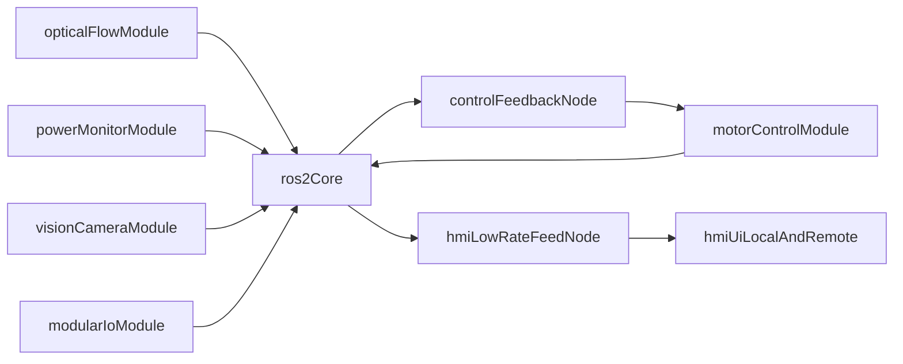

# Sensor Platform Execution Plan (Imported Snapshot)

Source: Cursor plan file originally stored outside the repo.  
Imported on: 2026-04-23

## Overview

Create a documentation-first execution plan that finishes optical-flow polishing first, then stages power monitoring, camera/AI vision, modular IO, motor control, and ROS2/HMI integration. Produce a module-switchable backlog and per-module architecture docs aligned with naming and interface conventions.

## Imported Plan TODO Status

- `completed` Review current architecture, handoff, and optical-flow docs and map reusable sections into the new module-oriented planning structure.
- `completed` Create module-switchable project backlog doc with checklists, today-focus section, and troubleshooting note templates.
- `completed` Revise ball-rotation architecture doc with staged roadmap, cross-module contracts, safety/fault policies, and ROS2/HMI integration target.
- `completed` Create or update per-module docs (optical-flow, power-monitor, camera-ai, modular-io, motor-control, ros2-hmi) with agreed detail depth.
- `completed` Write shared conventions doc covering naming, script prefixes, directory layout, logging/config patterns, and documentation expectations.
- `completed` Add explicit optical-flow polish tasks: of_main usage docs, of_experimental redundancy review, LDR LUT experiment path, and Neopixel integration notes.
- `completed` Add power-monitor development plan for INA219 scaling, shunt replacement calibration, polling strategy, smoke tests, and ROS2 readiness.
- `completed` Cross-check docs for naming consistency, module link integrity, and complete acceptance criteria before implementation starts.

## Plan Body

### Outcomes for this planning pass

- Update the system architecture docs to reflect the full staged roadmap and interfaces.
- Establish a module-by-module documentation structure (detailed for optical-flow + power/motor, lightweight for camera + modular IO at first).
- Create a single project backlog that supports module switching, checklist progress, and troubleshooting notes.
- Define naming conventions and folder/script conventions up front so implementation stays consistent.

### Planned documentation changes

- Update `docs/ball-rotation-architecture.md`:
  - Add explicit staged roadmap in this order:
    1) optical-flow polish,
    2) power monitor module,
    3) camera + AI HAT experiments,
    4) modular IO board,
    5) motor driver C++ interface,
    6) ROS2 + HMI integration.
  - Add cross-module interface contracts (data produced/consumed, expected rates, safety actions).
  - Add safety and fault escalation policy (overcurrent, undervoltage, estop, overvoltage, sensor dropouts).

- Add/update a master backlog doc in `docs`:
  - Module switchboard section with quick links to each module doc.
  - Checklist sections by module with status markers (`todo`, `doing`, `blocked`, `done`).
  - Troubleshooting log template (symptom, context, root cause, fix, follow-up).
  - “Today focus” section so work can rotate between modules without losing context.

- Add/update per-module docs under `docs/modules/`:
  - `optical-flow.md` (detailed)
  - `power-monitor.md` (detailed)
  - `camera-ai.md` (lightweight initially)
  - `modular-io.md` (lightweight initially)
  - `motor-control.md` (detailed)
  - `ros2-hmi-integration.md` (integration-focused)
  - `conventions.md` (shared naming, script prefixes, config/log patterns)

### Module architecture and scope (implementation phases)

#### 1) Optical Flow polish (first)

- Keep `of_main.py` as the primary entrypoint with concise CLI usage notes for local and SSH use.
- Review `of_experimental.py` and define retention rules:
  - keep only truly experimental functionality,
  - remove/redirect redundant functionality already covered by dedicated scripts.
- Plan new LDR feedback calibration flow:
  - add experimental LDR read path (via Maker Pi ADC) for LED feedback characterization,
  - derive LED brightness lookup table to reduce visible output non-linearity,
  - integrate lookup table into calibration workflow once validated.
- Add Neopixel ring integration as optional external lighting control input to calibration experiments.
- Consolidate script naming/roles and document argument usage and expected outputs.
- Deliverable: one optical-flow “ready for ROS2 wrapping” baseline with clear calibration and smoke-test path.

#### 2) Power monitor module (new parallel directory)

- Create module parallel to optical_flow (planned: `power_monitor/`) with script prefix standard `pwr_<name>.py`.
- Scope:
  - INA219 4-channel bring-up and verification,
  - shunt replacement impact model and scaling/calibration plan,
  - register/unit conversion strategy,
  - calibration protocol using multimeter reference,
  - polling/bandwidth optimization for stable I2C behavior,
  - logging/graphing + smoke test + experimental script,
  - ROS2-node-ready interface definition.
- Include SMBus exploration decision note (keep if practical/stable, otherwise document rejection rationale).

#### 3) Camera + AI HAT module (new parallel directory)

- Create module parallel to optical_flow (planned: `vision_camera/`).
- Scope:
  - global shutter camera local + SSH feed access,
  - browser/HMI low-fps stream path,
  - AI HAT+ pipeline assumptions and driver/setup checklist,
  - OpenCV-based experiments for ball detection + seam feature tracking,
  - motion outputs for translation and rotation estimation,
  - optional Neopixel-assisted illumination tuning strategy,
  - ROS2 split outputs: control-feedback stream and low-res HMI stream.

#### 4) Maker Pi modular IO module (new parallel directory)

- Create module parallel to optical_flow (planned: `modular_io/`).
- Scope:
  - USB-connected sensor/control coprocessor setup,
  - MicroPython/CircuitPython experimentation path,
  - ToF/ultrasonic + encoder/button + small display interaction model,
  - live-update workflow assumptions,
  - ROS2 translation path for sensor and setpoint/control signals.

#### 5) Motor drivers module (new/expand parallel directory)

- Use/expand motor-control area (planned: `motor_control/`) with C++-first driver interface strategy.
- Scope:
  - robust comm options (USB/alternative serial paths) with wiring/runbook documentation,
  - replacement of deprecated Python path with C++ interface suitable for high-rate control,
  - smoke tests, calibration routines, bandwidth optimization, logging/graphing,
  - runtime tuning/control surfaces: PID, setpoints, safety states, encoder/velocity/acceleration telemetry,
  - explicit handling of estop, overvoltage signals, and power-event diagnostics.

#### 6) ROS2 + HMI system integration

- Define node boundaries and topics for all modules.
- Add profile/parameter management strategy for predefined operating modes.
- Define local touchscreen HMI + remote browser mirror architecture.
- Ensure observability path (logs, trends, error states, troubleshooting traces) spans all modules.

### High-level dataflow (target)

### Conventions to lock in before coding

- Python script naming:
  - optical flow scripts stay `of_<name>.py`.
  - power scripts use `pwr_<name>.py`.
- Keep snake_case for Python modules, params, and topic-like identifiers in docs unless ROS2 naming rules require otherwise.
- Each module doc should include: purpose, interfaces, calibration/smoke-test path, logging outputs, ROS2 readiness, open issues.
- Keep one authoritative conventions reference doc and link all module docs to it.

### Acceptance criteria for this planning cycle

- Architecture doc reflects the new staged roadmap and module interactions.
- A single project backlog exists with module switchboard + checklists + troubleshooting notes.
- Per-module docs exist with agreed depth (detailed for optical-flow + power/motor; lightweight for camera + modular IO).
- Optical-flow plan explicitly includes LDR LUT experiment path and `of_experimental.py` cleanup criteria.
- Power, camera, modular IO, motor modules each have a clear first smoke-test and first calibration milestone documented.
